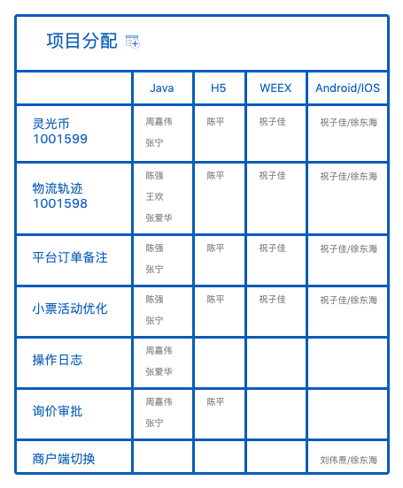

# 项目一组




## [进行中](.):
[【优选——物流轨迹】 1001598](./1001598/index.html)
```
陈强、王欢、张宁、陈平、祝子佳

```    

[【优选2级分类】 1001554](./1001554/index.html)
 ```
 陈强、陈平、祝子佳
    Java    4.24提测（本周三）
    WEEX    4.24提测（本周三）
    H5      4.29提测（下周一） 计划延期
```    

[【满额包邮优化2】 1001553](./1001553/index.html)
 ```
 王欢、陈平、祝子佳
 本周日提测，预计发布时间4.30（正在协调延期至节后）
```   

## [测试、验收中](.):

[【优选搜索】 1001552](./1001552/index.html)


## [规划中](.)：


## [已发布](.)：


Markdown is a lightweight and easy-to-use syntax for styling your writing. It includes conventions for

```markdown
Syntax highlighted code block

# Header 1
## Header 2
### Header 3


- Bulleted
- List

1. Numbered
2. List
**Bold** and _Italic_ and `Code` text

[Link](url) and 
```
